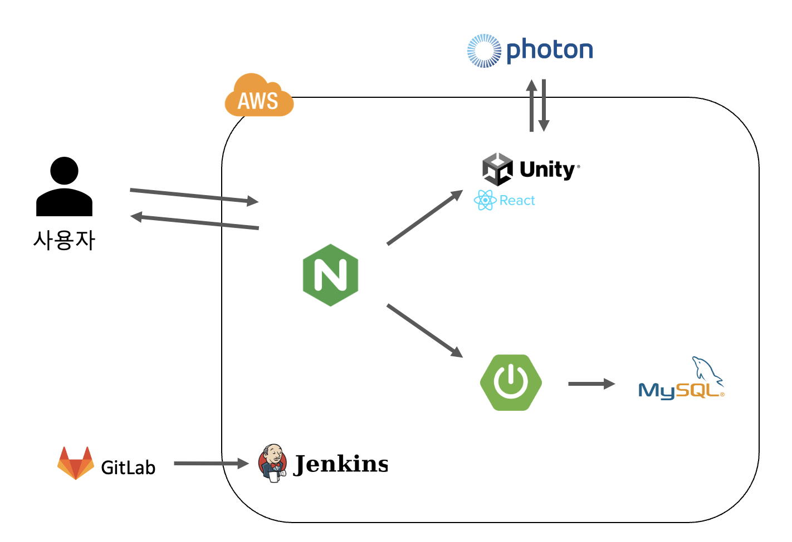
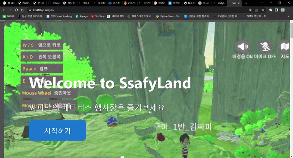
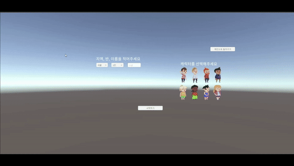

## 🗺️ SsafyLand

---

Ssafy Meet Up, SsafyDay 등 싸피인들을 위한 행사장을 메타버스로 구현

## 👨‍👦‍👦 팀원 소개

---

- 김다예
- 김성우
- 임현모
- 이명성
- 이상현
- 최대호

<br/>

## 📄 프로젝트 개요

---

### **진행 기간** : 2022.04.11 ~ 2011.05.20

### 기획 의도

**SSAFY 밋업(meetup)**은 전국의 싸피인들이 모여 함께 즐기는 행사이다. 하지만 최근 코로나 상황이 악화되면서 기존에는 오프라인으로 진행되던 밋업 행사 역시 **유튜브 실시간 라이브**를 통한 비대면 방식으로 바뀌었다.

유튜브를 통한 비대면 행사는 전국의 싸피인들이 장소에 상관 없이 어디서나 참여할 수 있다는 장점을 지니고 있으나, 서로 얼굴을 맞대고 있지 않기 때문에, **교육생들의 다양한 반응을 확인하기 어렵고**, 모든 것이 영상 속에서 진행되므로 **현장감이 부족하게 느껴져** 행사에 대한 몰입도가 떨어진다. 마지막으로 전국의 SSAFY인들이 모이는 큰 행사임에도, 호스트와 교육생 간 대화만 존재할 뿐, **SSAFY 교육생들 간에 소통이 이루어지기 어렵다**.

### **기대 효과**

- 코로나 상황으로 인해 즐기지 못했던 **야외 활동이나 대면 만남**을 메타버스 상에서 **간접적으로 경험**하며 스트레스를 해소할 수 있다.
- 기존의 유튜브 영상만을 시청하던 때와 달리 현장에 있는 것처럼 **행사에 대한 몰입도가 향상**될 수 있다.
- **SSAFY 밋업 참가자 간의 상호작용**이 이전의 댓글 소통방식보다 **활성화**될 수 있다.

<br/>

## 프로젝트 아키텍처

---

### 사용 기술

- Unity(2020.3.33f1)
- Plastic scm
- React.js(18.0.0)
- Photon cloud
- OpenVidu
- Spring boot(2.6.7)
- MySQL(8)
- Git
- AWS
- Jenkins
- Docker



<br/>

## ⭐ 주요 기능

---

### 랜딩페이지




### 무대

- 맵 위의 주요 행사를 할 수 있는 무대입니다.
- 행사 진행에 필요한 PDF를 열어서 공유할수 있습니다.




### OX 게임

- O/X 퀴즈 게임 기능입니다.
- 사람들은 문제에 맞는 곳에 갈 수 있으며, 정답 유무에 따라 사용자들은 퀴즈 장소에 남거나 다른 장소로 옮겨집니다.


### 인내의 숲

- 벽돌을 밟고 점점 더 높이 올라가는 게임입니다.
- 랭킹시스템을 구현하여 누가 먼저 도착했는지 순위를 매깁니다.


### 보물찾기

- 오브젝트와 상호작용하여 보물을 찾을 수 있는 기능을 구현합니다.
- 랭킹시스템을 구현하여 누가 더 많이 찾았는지 순위를 매깁니다.


### 전시관

- SSAFY에서 했던 활동들을 보여주는 장소입니다.
- 각 프로젝트 앞에서 오브젝트와 상호작용을 하면 해당 프로젝트를 볼 수 있습니다.


### 포토존

- 사진을 찍을 수 있는 공간으로 사용자들끼리 모여서 사진을 찍을 수 있습니다.
- 현재 화면을 캡쳐할 수 있으며, 캡쳐한 사진을 파일로 저장합니다.


<br/>

### 기타 기능

> 채팅 기능

- 사용자들은 전체 채팅으로 채팅 기능을 할 수 있습니다.

> 아바타 감정 표현 기능

- 감정에 맞는 버튼을 클릭하면 사용자 캐릭터는 해당 감정에 맞는 표현을 할 수 있습니다.

> 지도 기능

- 월드 전체 지도를 보여줄 수 있으며, 사용자가 위치한 곳을 보여줍니다.
- 주요 장소로 이동하기 버튼을 클릭하면 해당 장소로 이동할 수 있습니다.

<br/>

## ⚒️ Installation

---

```bash
# frontend
# dir /frontend
npm install
npm start
# frontend build
npm run build

# backend
# dir /backend
./gradlew clean build

docker-compose up -d --build --force-recreate
```

## 🗃️ 최종 산출물

---

### 중간 발표

[SSAFYLand\_중간발표.pdf](exec/SSAFYLand_%EC%A4%91%EA%B0%84%EB%B0%9C%ED%91%9C.pdf)

### 최종 발표

### UCC
