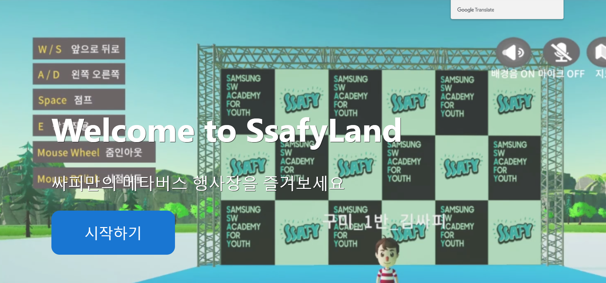
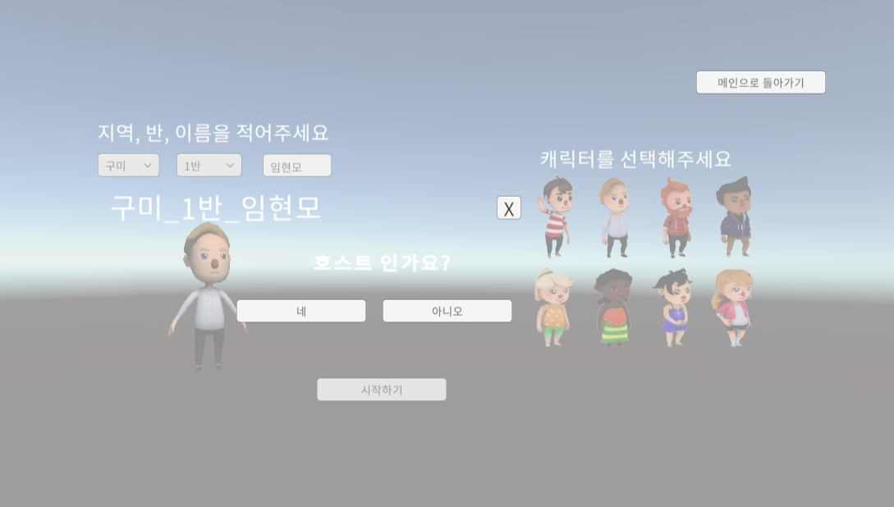
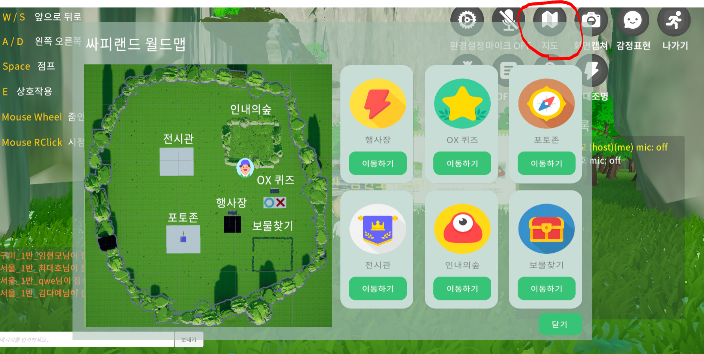
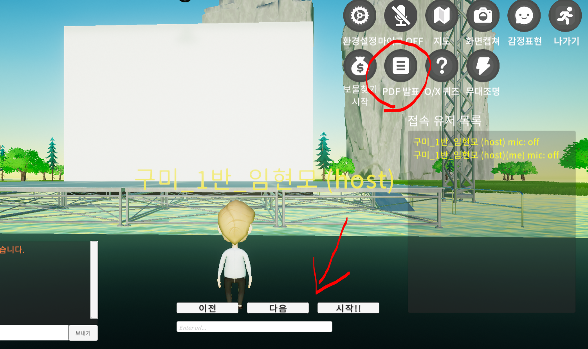
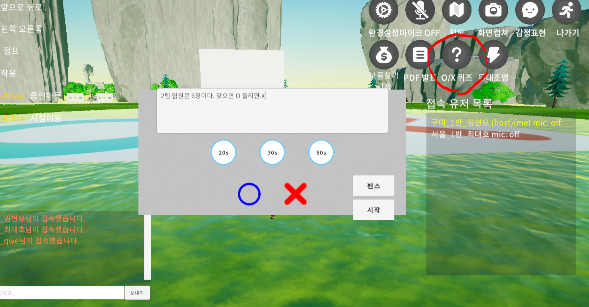
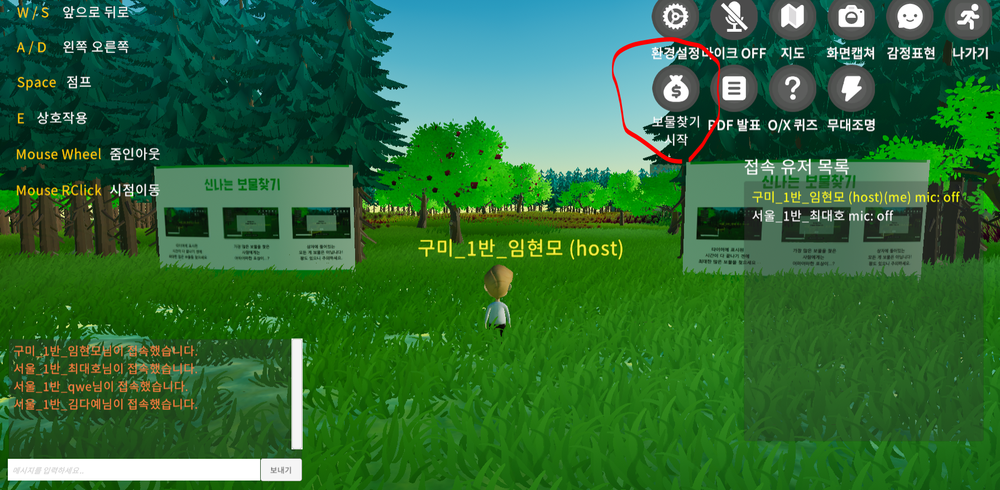
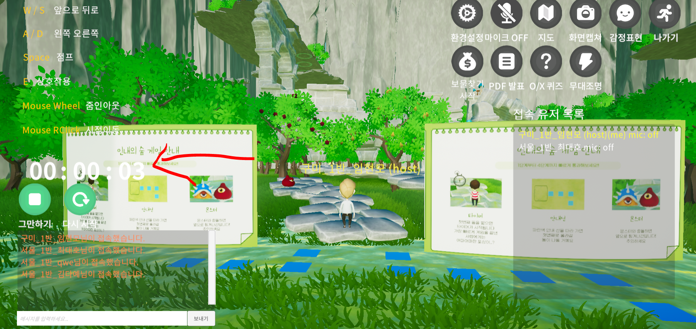
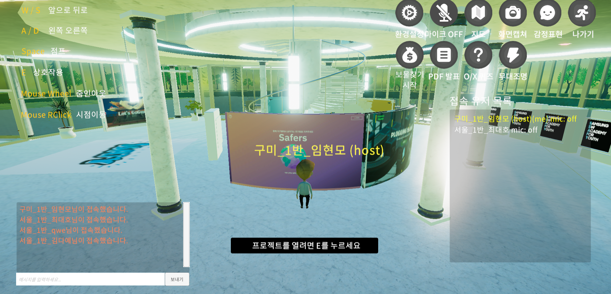
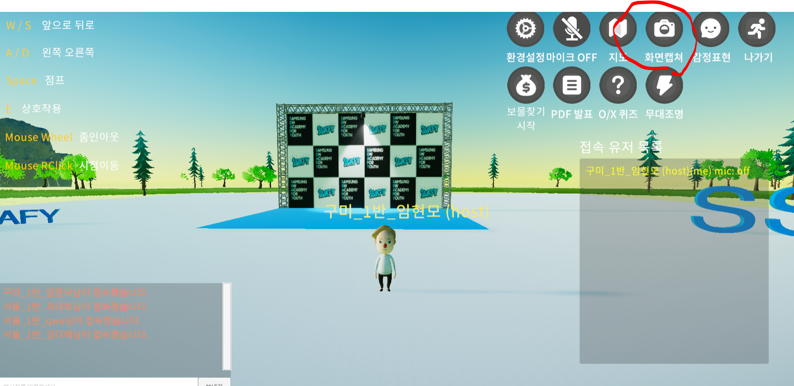

# 시작하기

- 시작하기 버튼을 눌러서 접속합니다.

# 로비

- 여기서 일반 사용자면 아니오를 클릭하고 호스트면 네를 클릭하면 됩니다.
- 호스트 비밀번호 0000을 입력하여 접속합니다.

- 이 이후부터는 순서 상관없이 자유롭게 컨텐츠를 이용하면 됩니다.

# 지도

- 캐릭터 이동으로 돌아다닐수 있지만 편의상 지도와 순간이동 기능을 제공합니다.
- 지도를 누르고 각 컨텐츠의 입구로 이동할수 있습니다.
- 그 외 UI메뉴들은 보이는대로 사용 가능합니다.

# 무대

- PDF 발표는 호스트만 실행 가능합니다.
- 버튼 누르고 밑의 input 칸에 public 폴더 경로 안에 있는 PDF 파일의 이름과 확장자를 적어서 실행하면 무대의 스크린에 PDF가 공유됩니다.

# OX

- OX 퀴즈는 호스트만 실행이 가능합니다.
- UI 버튼을 누르고 input 칸에 문제를 적습니다.
- 이후 제한시간과 정답, 시작을 눌러서 실행합니다.

# 보물찾기

- 보물찾기는 호스트만 실행이 가능합니다.
- 보물찾기 시작을 누르면 보물찾기 맵에서 랜덤한 위치에 보물상자들이 떨어집니다.
- 상자에는 꽝, 당첨이 있고 보물찾기 종료 시에 찾은 보물갯수로 등수를 나누는 UI가 출력됩니다.

# 인내의 숲

- 인내의 숲은 첫 칸을 밟을때 자동 실행됩니다.
- 끝에 도달하는데 걸리는 시간으로 등수가 나누어 집니다.

# 전시관

- E를 눌러 이전 기수의 프로젝트를 열람할수 있습니다.

# 포토존

- 화면 캡쳐는 꼭 포토존이 아니더라도 사용이 가능합니다.
- 화면캡쳐를 누르면 현재 화면을 캡쳐하여 파일로 저장합니다.